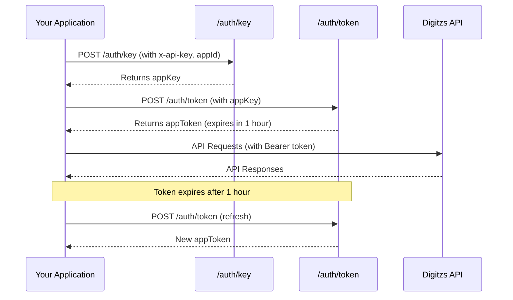

## Overview

The Authorization endpoints handle authentication and authorization for the Digitzs API. A two-step process is required:

1. Generate an app key using your API credentials
2. Create an access token using the app key

<Info>
  Access tokens expire after one hour and must be refreshed regularly.
</Info>

## Authorization Flow



## Endpoints

<CardGroup cols={2}>
  <Card
    title="Create API Key"
    icon="key"
    href="/api-reference/authorization/create-key"
  >
    Generate an app key for token creation

    `POST /auth/key`
  </Card>
  <Card
    title="Create App Token"
    icon="lock"
    href="/api-reference/authorization/create-token"
  >
    Generate an access token (expires in 1 hour)

    `POST /auth/token`
  </Card>
</CardGroup>

## Quick Start

### Step 1: Create App Key

```bash
curl -X POST https://api.digitzs.com/auth/key \
  -H "x-api-key: your-api-key" \
  -H "Content-Type: application/json" \
  -d '{
    "data": {
      "type": "auth",
      "attributes": {
        "appId": "your-app-id"
      }
    }
  }'
```

### Step 2: Create App Token

```bash
curl -X POST https://api.digitzs.com/auth/token \
  -H "x-api-key: your-api-key" \
  -H "Content-Type: application/json" \
  -d '{
    "data": {
      "type": "auth",
      "attributes": {
        "appKey": "app-key-from-step-1"
      }
    }
  }'
```

### Step 3: Use Token in Requests

```bash
curl -X GET https://api.digitzs.com/merchants \
  -H "Authorization: Bearer your-app-token" \
  -H "x-api-key: your-api-key" \
  -H "appId: your-app-id"
```

## Best Practices

<AccordionGroup>
  <Accordion title="Secure Storage" icon="vault">
    Store your API key and app key securely:
    - Use environment variables
    - Never commit credentials to version control
    - Use secret management services in production
  </Accordion>

  <Accordion title="Token Caching" icon="clock">
    Cache access tokens and reuse them:
    - Tokens are valid for 1 hour
    - Track token expiration time
    - Refresh tokens proactively before expiration
  </Accordion>

  <Accordion title="Error Handling" icon="shield-exclamation">
    Implement robust error handling:
    - Catch 401 errors and refresh tokens automatically
    - Implement retry logic with exponential backoff
    - Log authentication failures for monitoring
  </Accordion>

  <Accordion title="Key Rotation" icon="arrows-rotate">
    Rotate app keys periodically:
    - Creating a new app key invalidates the old one
    - Plan key rotation during low-traffic periods
    - Update all services using the old key
  </Accordion>
</AccordionGroup>

## Common Issues

<Warning>
  **Token Format:** The Authorization header must be formatted as `Bearer {token}` with:
  - A capital "B" in "Bearer"
  - A space between "Bearer" and your token
</Warning>

<Tip>
  **Token Expiration:** Implement automatic token refresh 5 minutes before expiration to avoid service interruptions.
</Tip>

## Security Considerations

<CardGroup cols={2}>
  <Card title="HTTPS Only" icon="lock">
    Always use HTTPS for API requests to protect credentials in transit
  </Card>
  <Card title="Credential Rotation" icon="key">
    Rotate API keys and app keys regularly as part of security best practices
  </Card>
  <Card title="Limited Scope" icon="shield-check">
    Use separate API keys for different environments (dev, staging, production)
  </Card>
  <Card title="Monitoring" icon="chart-line">
    Monitor authentication failures and unusual access patterns
  </Card>
</CardGroup>

## Next Steps

<Steps>
  <Step title="Get Credentials">
    Contact Digitzs to receive your API key and application ID
  </Step>
  <Step title="Test Authentication">
    Follow the quick start guide to test the authentication flow
  </Step>
  <Step title="Implement Token Management">
    Build token caching and refresh logic into your application
  </Step>
  <Step title="Start Using the API">
    Begin making authenticated requests to other endpoints
  </Step>
</Steps>

## Additional Resources

<CardGroup cols={2}>
  <Card
    title="Authentication Guide"
    icon="book"
    href="/authentication"
  >
    Detailed authentication tutorial with code examples
  </Card>
  <Card
    title="Error Codes"
    icon="triangle-exclamation"
    href="/error-codes"
  >
    Handle authentication errors properly
  </Card>
</CardGroup>
