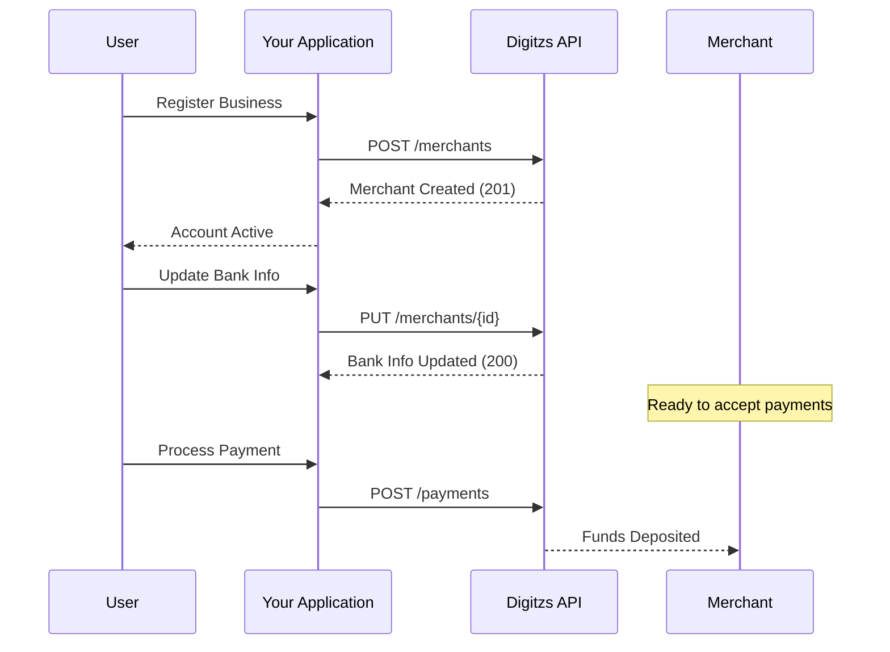

## Overview

The Merchant endpoints allow you to create, update, and manage merchant accounts within your application. Merchants can be created in real-time, enabling your users to start accepting payments immediately without leaving your platform.

<Info>
  Merchants pay a flat rate of 2.9% + 30¢ per transaction with no hidden fees or surprise charges.
</Info>

## Key Features

<CardGroup cols={3}>
  <Card title="Real-Time Creation" icon="bolt">
    Create merchant accounts instantly without manual approval
  </Card>
  <Card title="Complete Management" icon="sliders">
    Update settings, bank info, and preferences programmatically
  </Card>
  <Card title="Instant Funding" icon="gauge-high">
    Eligible merchants can receive funds instantly with qualified debit cards
  </Card>
</CardGroup>

## Available Endpoints

<CardGroup cols={2}>
  <Card
    title="Create Merchant"
    icon="plus"
    href="/api-reference/merchants/create-merchant"
  >
    Create a new merchant account

    `POST /merchants`
  </Card>
  <Card
    title="Get Merchant"
    icon="magnifying-glass"
    href="/api-reference/merchants/get-merchant"
  >
    Retrieve merchant details

    `GET /merchants/{id}`
  </Card>
  <Card
    title="List Merchants"
    icon="list"
    href="/api-reference/merchants/list-merchants"
  >
    Get all merchants in your account

    `GET /merchants`
  </Card>
  <Card
    title="Update Bank Info"
    icon="building-columns"
    href="/api-reference/merchants/update-bank-info"
  >
    Update merchant banking information

    `PUT /merchants/{id}`
  </Card>
  <Card
    title="Update AVS Mode"
    icon="shield-check"
    href="/api-reference/merchants/update-avs-mode"
  >
    Configure Address Verification Service settings

    `PUT /merchants/{id}`
  </Card>
</CardGroup>

## Quick Start

### Create a Merchant

```bash
curl -X POST https://api.digitzs.com/merchants \
  -H "Authorization: Bearer your-app-token" \
  -H "x-api-key: your-api-key" \
  -H "appId: your-app-id" \
  -H "Content-Type: application/json" \
  -d '{
    "data": {
      "type": "merchants",
      "attributes": {
        "businessInfo": {
          "businessName": "Acme Corporation",
          "businessType": "LLC",
          "taxId": "12-3456789",
          "phoneNumber": "555-123-4567",
          "website": "https://acme.example.com"
        },
        "contactInfo": {
          "firstName": "John",
          "lastName": "Doe",
          "email": "john@acme.example.com",
          "phone": "555-123-4567"
        },
        "address": {
          "street": "123 Main St",
          "city": "San Francisco",
          "state": "CA",
          "postalCode": "94105",
          "country": "US"
        },
        "bankInfo": {
          "accountName": "Acme Corporation",
          "accountNumber": "1234567890",
          "routingNumber": "026009593",
          "accountType": "checking"
        }
      }
    }
  }'
```

### List Merchants

```bash
curl -X GET https://api.digitzs.com/merchants \
  -H "Authorization: Bearer your-app-token" \
  -H "x-api-key: your-api-key" \
  -H "appId: your-app-id"
```

## Merchant Lifecycle



## Merchant Data Structure

### Business Information

| Field | Description |
|-------|-------------|
| `businessName` | Legal business name |
| `businessType` | Entity type (LLC, Corporation, Sole Proprietor, etc.) |
| `taxId` | Federal Tax ID or EIN |
| `phoneNumber` | Business phone number |
| `website` | Business website URL (optional) |

### Contact Information

| Field | Description |
|-------|-------------|
| `firstName` | Contact person's first name |
| `lastName` | Contact person's last name |
| `email` | Contact email address |
| `phone` | Contact phone number |

### Bank Information

| Field | Description |
|-------|-------------|
| `accountName` | Name on the bank account |
| `accountNumber` | Bank account number |
| `routingNumber` | Bank routing number (ABA) |
| `accountType` | Account type (checking or savings) |

### Address Information

| Field | Description |
|-------|-------------|
| `street` | Street address |
| `city` | City name |
| `state` | State code (2 letters) |
| `postalCode` | ZIP or postal code |
| `country` | Country code (2 letters, e.g., US) |

## Address Verification Service (AVS)

AVS helps prevent fraud by verifying the cardholder's billing address matches the address on file with the card issuer.

### AVS Modes

| Mode | Description |
|------|-------------|
| `strict` | Reject transactions if AVS check fails |
| `moderate` | Flag suspicious transactions but allow processing |
| `lenient` | Log AVS results but don't block transactions |
| `off` | Disable AVS checking |

<Warning>
  Disabling AVS increases fraud risk. Use strict or moderate mode for best security.
</Warning>

## Merchant Status

| Status | Description |
|--------|-------------|
| `active` | Merchant can accept payments |
| `pending` | Account under review |
| `suspended` | Account temporarily disabled |
| `closed` | Account permanently closed |

## Testing

### Test Mode

When using test credentials, you can create test merchants without real business verification:

```json
{
  "data": {
    "type": "merchants",
    "attributes": {
      "businessInfo": {
        "businessName": "Test Business",
        "businessType": "Sole Proprietor",
        "taxId": "00-0000000"
      },
      ...
    }
  }
}
```

## Revenue Sharing

As a platform using Digitzs, you earn revenue on every transaction processed by your merchants:

<AccordionGroup>
  <Accordion title="Platform Fees" icon="coins">
    Configure your platform fee percentage or fixed amount per transaction. Fees are automatically deducted and deposited to your account.
  </Accordion>

  <Accordion title="Automatic Splits" icon="scissors">
    Use split payments to automatically distribute funds between the merchant and your platform without manual invoicing.
  </Accordion>

  <Accordion title="Real-Time Revenue" icon="chart-line">
    Track your platform revenue in real-time with detailed reporting and analytics.
  </Accordion>
</AccordionGroup>

## Compliance and Verification

<CardGroup cols={2}>
  <Card title="KYC Requirements" icon="id-card">
    Merchants must provide valid business and identity information for compliance
  </Card>
  <Card title="Bank Verification" icon="building-columns">
    Bank account details are verified during merchant onboarding
  </Card>
  <Card title="Tax Reporting" icon="file-invoice">
    Digitzs handles tax reporting and 1099 generation for merchants
  </Card>
  <Card title="Risk Management" icon="shield-halved">
    Automated fraud detection and risk assessment for all merchants
  </Card>
</CardGroup>

## Best Practices

<AccordionGroup>
  <Accordion title="Validate Input Data" icon="check">
    - Verify email addresses are valid
    - Validate phone numbers are properly formatted
    - Check tax IDs match business entity type
    - Ensure routing numbers are valid ABA numbers
  </Accordion>

  <Accordion title="Store Merchant IDs" icon="database">
    - Save the returned merchant ID with your user record
    - Use the merchant ID for all payment operations
    - Don't expose internal merchant IDs to end users
  </Accordion>

  <Accordion title="Handle Updates Carefully" icon="pen">
    - Some fields cannot be updated after creation
    - Bank info updates may require reverification
    - Notify merchants of any changes to their account
  </Accordion>

  <Accordion title="Monitor Account Status" icon="eye">
    - Regularly check merchant account status
    - Handle suspended or closed accounts appropriately
    - Notify merchants of any status changes
  </Accordion>
</AccordionGroup>

## Common Use Cases

<Tabs>
  <Tab title="Marketplace">
    **Scenario:** Multi-vendor marketplace where sellers need to accept payments

    **Implementation:**
    1. Create merchant account when seller registers
    2. Store merchant ID with seller profile
    3. Use merchant ID when processing orders
    4. Use split payments to collect platform fees

    **Benefits:**
    - Sellers get paid directly
    - Automatic fee collection
    - No manual payouts needed
  </Tab>

  <Tab title="Booking Platform">
    **Scenario:** Service providers need to receive payments from customers

    **Implementation:**
    1. Create merchant account for each service provider
    2. Process payments with provider's merchant ID
    3. Use instant funding for urgent cases
    4. Handle refunds for cancellations

    **Benefits:**
    - Fast provider payouts
    - Built-in refund handling
    - Automated fee collection
  </Tab>

  <Tab title="Affiliate Platform">
    **Scenario:** Multiple parties receive portions of each sale

    **Implementation:**
    1. Create merchant accounts for sellers
    2. Use multiple split payments
    3. Distribute to seller, platform, and affiliates
    4. Track commissions automatically

    **Benefits:**
    - Automatic commission splitting
    - Real-time revenue tracking
    - No manual calculations needed
  </Tab>
</Tabs>

## Error Handling

Common merchant creation errors and solutions:

| Error | Cause | Solution |
|-------|-------|----------|
| Invalid Tax ID | Tax ID format incorrect | Verify format matches entity type |
| Invalid Routing Number | Routing number not recognized | Use valid 9-digit ABA routing number |
| Duplicate Merchant | Email or Tax ID already used | Check for existing merchant account |
| Missing Required Field | Required field omitted | Include all mandatory fields |

## Next Steps

<Steps>
  <Step title="Create Test Merchant">
    Use test credentials to create a merchant account
  </Step>
  <Step title="Store Merchant ID">
    Save the merchant ID with your user record
  </Step>
  <Step title="Process Test Payment">
    Use the merchant ID to process a test payment
  </Step>
  <Step title="Verify Settlement">
    Check that funds are properly distributed
  </Step>
</Steps>

## Additional Resources

<CardGroup cols={2}>
  <Card
    title="Payment Endpoints"
    icon="credit-card"
    href="/api-reference/payments/overview"
  >
    Process payments for your merchants
  </Card>
  <Card
    title="Error Codes"
    icon="triangle-exclamation"
    href="/error-codes"
  >
    Handle merchant creation errors
  </Card>
</CardGroup>
