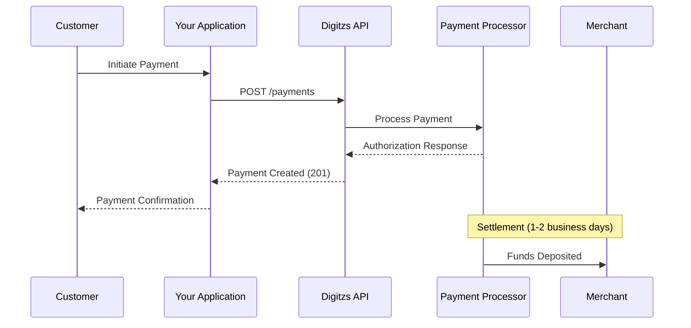

## Overview

The Payment endpoints enable you to accept online and mobile payments, process refunds, and retrieve transaction information. Digitzs supports card payments, ACH transfers, and split payments for marketplace applications.

<Info>
  All payment amounts must be specified in cents (smallest currency unit). For example, $10.00 = 1000 cents.
</Info>

## Payment Types

<CardGroup cols={3}>
  <Card title="Card Payments" icon="credit-card">
    Accept credit and debit card payments with instant authorization
  </Card>
  <Card title="ACH Payments" icon="building-columns">
    Process bank transfers via the Automated Clearing House network
  </Card>
  <Card title="Split Payments" icon="scissors">
    Automatically distribute funds between merchants and your platform
  </Card>
</CardGroup>

## Available Endpoints

### Create and Process

<CardGroup cols={2}>
  <Card
    title="Create Payment - Card"
    icon="credit-card"
    href="/api-reference/payments/create-payment-card"
  >
    Process a credit or debit card payment

    `POST /payments`
  </Card>
  <Card
    title="Create Payment - ACH"
    icon="building-columns"
    href="/api-reference/payments/create-payment-ach"
  >
    Process an ACH bank transfer

    `POST /payments`
  </Card>
</CardGroup>

### Split Payments

<CardGroup cols={2}>
  <Card
    title="Create Split Payment"
    icon="scissors"
    href="/api-reference/payments/create-split-payment"
  >
    Split payment between multiple recipients

    `POST /payments`
  </Card>
  <Card
    title="Add Additional Split"
    icon="plus"
    href="/api-reference/payments/add-split"
  >
    Add another split to an existing payment

    `POST /payments`
  </Card>
</CardGroup>

### Refunds and Voids

<CardGroup cols={2}>
  <Card
    title="Refund or Void Payment"
    icon="rotate-left"
    href="/api-reference/payments/refund-payment"
  >
    Refund a completed payment or void a pending one

    `POST /payments`
  </Card>
  <Card
    title="Refund Split"
    icon="split"
    href="/api-reference/payments/refund-split"
  >
    Refund a portion of a split payment

    `POST /payments`
  </Card>
</CardGroup>

### Retrieve Information

<CardGroup cols={3}>
  <Card
    title="Get Payment by ID"
    icon="magnifying-glass"
    href="/api-reference/payments/get-payment"
  >
    Retrieve payment details

    `GET /payments/{id}`
  </Card>
  <Card
    title="Get Payment Status"
    icon="circle-check"
    href="/api-reference/payments/get-payment-status"
  >
    Check payment processing status

    `GET /payments/status/{id}`
  </Card>
  <Card
    title="List Payments"
    icon="list"
    href="/api-reference/payments/list-payments"
  >
    Get all payments for a merchant

    `GET /payments`
  </Card>
</CardGroup>

## Quick Start

### Process a Card Payment

```bash
curl -X POST https://api.digitzs.com/payments \
  -H "Authorization: Bearer your-app-token" \
  -H "x-api-key: your-api-key" \
  -H "appId: your-app-id" \
  -H "Content-Type: application/json" \
  -d '{
    "data": {
      "type": "payments",
      "attributes": {
        "paymentType": "card",
        "merchantId": "merchant-123",
        "paymentMethod": {
          "token": "payment-method-token"
        },
        "transaction": {
          "amount": "1000",
          "currency": "USD",
          "invoice": "INV-001"
        }
      }
    }
  }'
```

### Process an ACH Payment

```bash
curl -X POST https://api.digitzs.com/payments \
  -H "Authorization: Bearer your-app-token" \
  -H "x-api-key: your-api-key" \
  -H "appId: your-app-id" \
  -H "Content-Type: application/json" \
  -d '{
    "data": {
      "type": "payments",
      "attributes": {
        "paymentType": "ACH",
        "merchantId": "merchant-123",
        "StandardEntryClassCode": "WEB",
        "bank": {
          "bankName": "Wells Fargo",
          "accountType": "checking",
          "accountName": "John Doe",
          "accountNumber": "1234567",
          "routingNumber": "026009593"
        },
        "transaction": {
          "amount": "1000",
          "currency": "USD",
          "invoice": "INV-001"
        }
      }
    }
  }'
```

## Payment Flow



## Common Use Cases

<AccordionGroup>
  <Accordion title="Single Payment" icon="credit-card">
    Process a one-time payment from a customer to a merchant using a card or ACH.

    **Best for:** E-commerce checkouts, subscription billing, invoices
  </Accordion>

  <Accordion title="Split Payment (Marketplace)" icon="scissors">
    Distribute payment between merchant and platform fee automatically.

    **Best for:** Marketplaces, platforms, booking services

    **Example:** $100 sale = $90 to merchant + $10 platform fee
  </Accordion>

  <Accordion title="Multiple Splits" icon="share-nodes">
    Split payment among multiple recipients (merchant, platform, referral partner).

    **Best for:** Multi-vendor platforms, affiliate programs

    **Example:** $100 sale = $85 merchant + $10 platform + $5 affiliate
  </Accordion>

  <Accordion title="Refunds and Voids" icon="rotate-left">
    Return funds to customer for canceled orders or disputes.

    **Void:** Cancel payment before settlement
    **Refund:** Return funds after settlement
  </Accordion>
</AccordionGroup>

## Payment Method Tokens

For security, card details should be tokenized before sending to the API. Digitzs provides a secure tokenization service:

<Tip>
  Use the Digitzs payment form or tokenization SDK to securely collect and tokenize payment methods on the client side.
</Tip>

## Transaction States

| State | Description |
|-------|-------------|
| `pending` | Payment initiated but not yet processed |
| `authorized` | Payment authorized but not captured |
| `completed` | Payment successfully processed |
| `failed` | Payment failed to process |
| `refunded` | Payment refunded to customer |
| `voided` | Payment canceled before settlement |

## Testing

### Test Card Numbers

| Card Number | Result |
|-------------|--------|
| `4111111111111111` | Successful charge |
| `4000000000000002` | Card declined |
| `4000000000009995` | Insufficient funds |
| `4000000000000069` | Expired card |

### Test ACH Accounts

Use any valid routing number with these account numbers:

| Account Number | Result |
|----------------|--------|
| `1234567` | Successful payment |
| `9876543` | Insufficient funds |

## Best Practices

<CardGroup cols={2}>
  <Card title="Idempotency" icon="shield-check">
    Use `requestId` (UUID v4) to prevent duplicate charges
  </Card>
  <Card title="Error Handling" icon="triangle-exclamation">
    Always check response codes and handle errors gracefully
  </Card>
  <Card title="Amount Validation" icon="calculator">
    Validate amounts on client side before submitting
  </Card>
  <Card title="Status Checks" icon="magnifying-glass">
    Verify payment status before fulfilling orders
  </Card>
</CardGroup>

## Security Considerations

<Warning>
  **Never store raw card data.** Always use tokenized payment methods and comply with PCI DSS requirements.
</Warning>

- Use HTTPS for all API requests
- Tokenize payment methods on the client side
- Implement fraud detection and velocity checks
- Log all payment transactions for audit trails
- Monitor for suspicious activity patterns

## Next Steps

<Steps>
  <Step title="Set Up Merchant Account">
    Create a merchant account to receive payments
  </Step>
  <Step title="Integrate Payment Form">
    Add payment collection to your application
  </Step>
  <Step title="Test Payments">
    Use test cards to verify your integration
  </Step>
  <Step title="Go Live">
    Switch to production credentials and start processing real payments
  </Step>
</Steps>

## Additional Resources

<CardGroup cols={2}>
  <Card
    title="Error Codes"
    icon="triangle-exclamation"
    href="/error-codes"
  >
    Handle payment errors properly
  </Card>
  <Card
    title="Merchant Endpoints"
    icon="store"
    href="/api-reference/merchants/overview"
  >
    Manage merchant accounts
  </Card>
</CardGroup>
